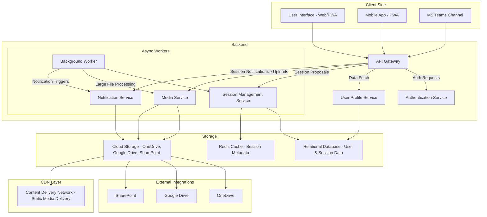

# Nexus
A central point where engineers connect their knowledge and propose ideas.A place where ideas are crafted and transformed into sessions

**Purpose:** Engineers express interest in hosting sessions, providing details about themselves and their proposed topics.
- An engineer who would like to host a session will register his/her expression of interest including his/her about me part
- the request will then review by guild editors. they could be able to communicate on the topic to understand more and have an option to nourish the idea and eventually approve or reject the guild topic 
- once it's been approved, the engineer will have opportunity to propose a closest date for his/her session

---

```mermaid
 
architecture-beta
    group api(logos:aws-lambda)[API]

    service db(logos:aws-aurora)[Database] in api
    service disk1(logos:aws-glacier)[Storage] in api
    service disk2(logos:aws-s3)[Storage] in api
    service server(logos:aws-ec2)[Server] in api

    db:L -- R:server
    disk1:T -- B:server
    disk2:T -- B:db
 

 


```

